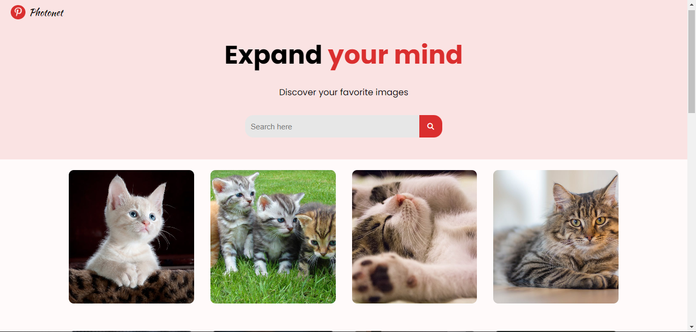

# photonett

This website generates different images using Pexels API, includes a search feature, and has a "Load More" button to fetch additional images. The project is built with HTML, CSS, and JavaScript.

## Features

- **Image Generation**: Fetches images from an API.
- **Search Feature**: Allows users to search for specific images.
- **Load More Button**: Loads more images upon user request.

## Demo



```bash
https://hallowdread.github.io/photonett/

```

## Installation

1. Clone the repository:

   ```bash
   git clone https://github.com/Hallowdread/photonett.git
   cd photonett
   ```

2. Open `index.html` in your web browser.

## Usage

1. **Search for Images**: Enter a keyword in the search bar and press "Search".
2. **Load More Images**: Click the "Load More" button to fetch additional images.
